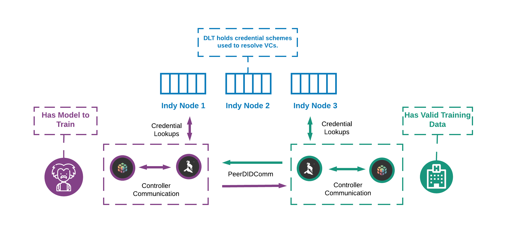

# PyDentity

In this repo we are creating a set of libraries to facilitate education and experimentation with the Hyperledger Aries framework for implementing secure identification and authentication procedures using Decentralised Identifiers(DIDs) and Verifiable Credentials (VCs).

Ultimately we are exploring how to create a [Distributed Trust System for Privacy Preserving Machine Learning](https://arxiv.org/abs/2006.02456) that can work with PySyft. We're using HL-Aries Agents to establish an end-end encrypted channel which will facilitate syft communications. We can then extend this with credentials and governance systems.

**This is very experimental at this stage.**

## Requirements
This project is written in Python and is displayed in jupyter notebooks.

You need to install:
1. [Docker](https://docs.docker.com/get-docker/)
2. [docker-compose](https://docs.docker.com/compose/install/)
3. The **source-to-image** (s2i) tool is also required to build the docker images used in the demo. S2I can be downloaded [here](https://github.com/openshift/source-to-image). The website gives instructions for installing on other platforms like MACOS, Linux, Windows.
Verify that **s2i** is in your PATH.  If not, then edit your PATH and add the directory where **s2i** is installed.  The **manage** script will look for the **s2i** executable on your PATH.  If it is not found you will get a message asking you to download and set it on your PATH.
    - If you are using a Mac and have Homebrew installed, the following command will install s2i: `brew install source-to-image`
    - If you are using Linux, go to the [releases](https://github.com/openshift/source-to-image/releases/latest) page and download the correct distribution for your machine. Choose either the linux-386 or the linux-amd64 links for 32 and 64-bit, respectively. Unpack the downloaded tar with `tar -xvf "Release.tar.gz"`
    - If you are not sure about your Operating System you can visit [this](https://whatsmyos.com/) and/or follow the instructions.
    - You should now see an executable called s2i. Either add the location of s2i to your PATH environment variable, or move it to a pre-existing directory in your PATH. For example, `sudo cp /path/to/s2i /usr/local/bin` will work with most setups. You can test it using `s2i version`.

Ensure that Docker is running. If it is not try `sudo dockerd` in another terminal.

## Running a Tutorial or Project

You should now be able to run any of the tutorials or projects within this repo.

E.g for the main tutorial on the aries-basic-controller
1. Navigate to the root directory of the tutorial
`cd tutorials/1. Learning Aries, ACA-Py and the Basic Controller`
2. Spin up the docker-compose configuration
`./manage start`
3. Get the urls and tokens for the juypter notebook instances within the project
**From the root PyDentity folder**
`./scripts/get_URLS.sh`
4. Navigate to the urls this spits out and follow the instructions within the notebooks.

## Tutorials

In the tutorials folder you will find a set of series of juypter notebook tutorials walking through how to use the libraries contained within this repository. Each tutorial series can be run from it's folder using `./manage start`

### [Learning Aries, ACA-Py and the Basic Controller](./tutorials/1.%20Learning%20Aries,%20ACA-Py%20and%20the%20Basic%20Controller)

This series introduces Self-Sovereign Identity and provides all the information needed to get started developing with the Hyperledger SSI stack using the aries-basic-controller library we developed to provide code examples within the notebooks.

**This is a great place to start!** 

### [Public Ledgers and Mobile Wallets](./tutorials/2.%20Public%20Ledgers%20and%20Mobile%20Wallets)

In this series you will learn how to move your solutions from a local test network onto the publicly accessible internet by connecting to the Sovrin StagingNet. You will interact with the agents through the notebooks using a publically available mobile agent that you can download from the app store.

### [Sending files](./tutorials/3.%20Attachments)

In this series you will learn how to attach files and send them from Alice to Bob.

### [Multi-tenancy and Mediation](./tutorials/4.%20Multitenancy)

In this series you will learn mainly three things. Firstly, we show how to create wallets for Alice and Bob on the same agent. These wallets are called subwallets and are managed by a base wallet. We continue by exploring mediation of communication ([see here for more details](https://github.com/hyperledger/aries-cloudagent-python/blob/main/Mediation.md)). Lastly, the tutorial expands on these concept by introducing an external agent - external as in from an outside network. Here, we use familiar concepts from the second tutorial series. 

**This configuration also gives an example of how to configure an agent to use postgres for it's wallet storage**

## Libraries

### [aries-basic-controller](./libs/aries-basic-controller)

This is the core library in this repository. It is a simple python wrapper for the swagger api interface to an [aca-py ssi agent](https://github.com/hyperledger/aries-cloudagent-python). 

### [acapy-protocol-example](./libs/acapy-protocol-example)

This library gives a very basic example of how to extend the core set of protocols that an aca-py agent understand with a custom protocol.

### [attachment-protocol](./libs/attachment-protocol)

This library implements a basic attachment acapy protocol plugin using decorators.

### [attachment-controller](./libs/attachment-controller)

This library extends the basic controller to include the attachment protocol endpoints.

## Projects

### [Aries-FL](./projects/aries-fl)

An example of authenticated federated learning mediated by aries agents communicating over DIDComm.

### [Opus](./projects/opus)

SSI Third Party Credential Onboarding.

### [PryVote](./projects/pryvote)

SSI voting system.

### [Doctors in Training](./projects/doctors-in-training)

A real life use case of SSI developed as part of an NHS INTEROpen hackathon.

### [Single Agent](./project/single-agent)

This spins up a single agent (with attachment capability) pointing to the Sovrin StagingNet and publicly exposed using Ngrok. It includes an associated notebook. Our thought is you could use this to experiment with interoperability of other aries agents. For example aca-pico.
