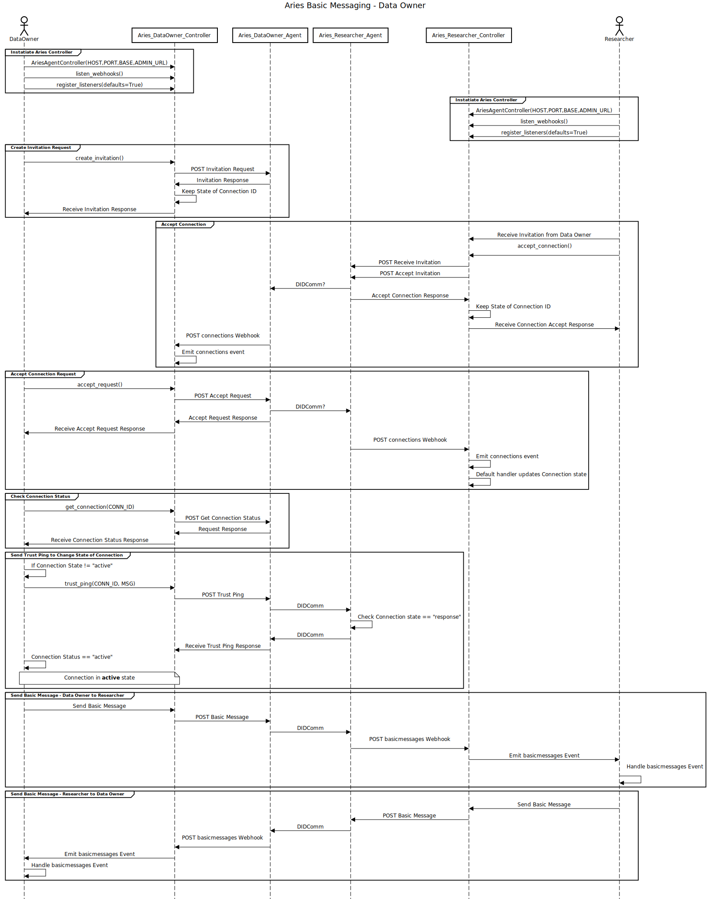

# PyDentity

# Requirements

* Docker
* Docker Compose v1.24

# Getting Started

From root directory run:
```
./manage up
```

Navigate to [researcher notebook](http://localhost:8889), you will find the token for this in the terminal you ran ./manage up from.

Navigate to [data notebook](http://localhost:8888), you will find the token for this in the terminal you ran ./manage up from.

Both juypeter instances should have a notebook, either researcher or data_owner. Open these up and follow the tutorial contianed within the notebooks.

# Sequence Diagram

# Sequence Diagram

Built using [Sequence Diagram](https://sequencediagram.org)


