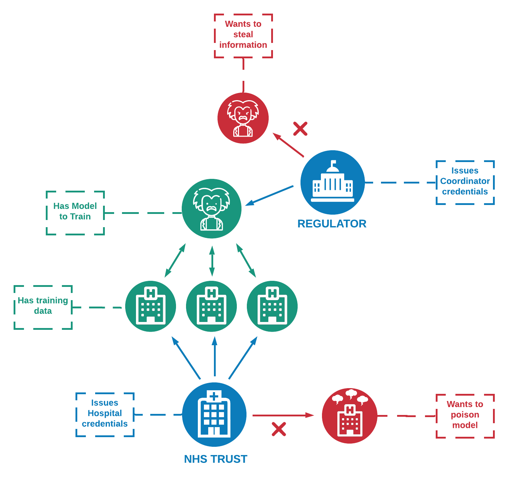

# Federated Learning over DIDComm

# Guide

# Created by

    Will Abramson (wip-abramson)
    Adam James Hall (H4LL)
    Pavlos Papadopoulos (pavlos-p)

## Publications
Papadopoulos, P., Abramson, W., Hall, A. J., Pitropakis, N., & Buchanan, W. J. (2021). Privacy and Trust Redefined in Federated Machine Learning. Machine Learning and Knowledge Extraction, 3(2), 333-356. ([link](https://www.mdpi.com/2504-4990/3/2/17))

Abramson, W., Hall, A. J., Papadopoulos, P., Pitropakis, N., & Buchanan, W. J. (2020, September). A Distributed Trust Framework for Privacy-Preserving Machine Learning. In International Conference on Trust and Privacy in Digital Business (pp. 205-220). Springer, Cham. ([link](https://link.springer.com/chapter/10.1007/978-3-030-58986-8_14) and [link](https://arxiv.org/abs/2006.02456))

You can cite this work using:

    @article{papadopoulos2021privacy,
        title={Privacy and Trust Redefined in Federated Machine Learning},
        author={Papadopoulos, Pavlos and Abramson, Will and Hall, Adam J and Pitropakis, Nikolaos and Buchanan, William J},
        journal={Machine Learning and Knowledge Extraction},
        volume={3},
        number={2},
        pages={333--356},
        year={2021},
        publisher={Multidisciplinary Digital Publishing Institute}
    }

    @article{abramson2020distributed,
        title={A Distributed Trust Framework for Privacy-Preserving Machine Learning},
        ISBN={9783030589868},
        ISSN={1611-3349},
        url={http://dx.doi.org/10.1007/978-3-030-58986-8_14},
        DOI={10.1007/978-3-030-58986-8_14},
        journal={Lecture Notes in Computer Science},
        publisher={Springer International Publishing},
        author={Abramson, Will and Hall, Adam James and Papadopoulos, Pavlos and Pitropakis, Nikolaos and Buchanan, William J.},
        year={2020},
        pages={205–220}
    }

