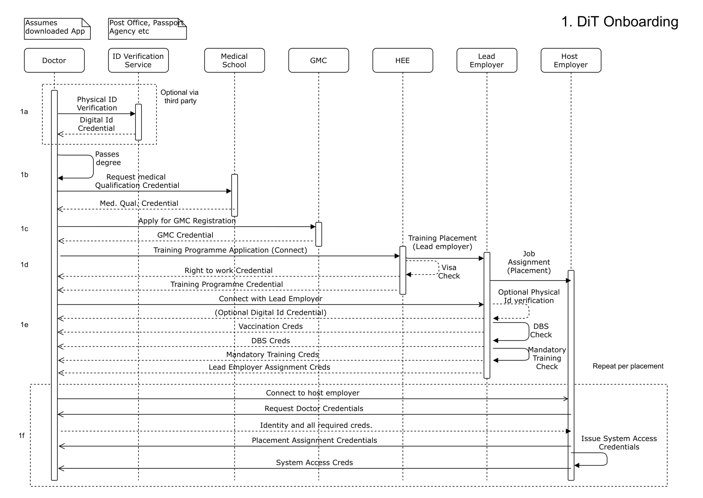

# Doctors in Training

### A real life use case for verifiable credentials developed at a recent INTEROpen Staff Access hackathon

The use case follows the following sequence diagram

### Running the example

With docker installed, run the example using `./manage start`

To go the first notebook [ID Verification](http://127.0.0.1:8888)

The notebooks requires a token that can be found in the logs. The token for the ID Verification Service can be fetched using the following command.

* `docker logs doctors-in-training_id-verifier-agent_1`

You can also fetch all notebook urls with tokens by running `./get_URLS.sh`
