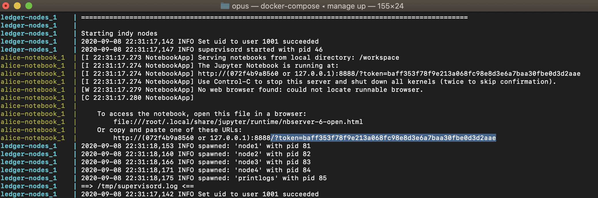

# Opus

Opus is a SSI-driven third party data onboarding project.
The project is in early development.

## Pre-requisites

1. Docker

## Demo Environment

- Opus Business Logic Notebook:8889
- Opus Agent:8051
- Alice Notebook:8888
- Alice Agent:8021
- Ledger Browser:9000

## How to run

Run `bash ./manage up` from this directory

In the terminal output you'll find the tokens for your notebooks;

Begin the tutorials from the Opus Notebook. Notebooks mount their respective directories in './demo'. Enjoy!
